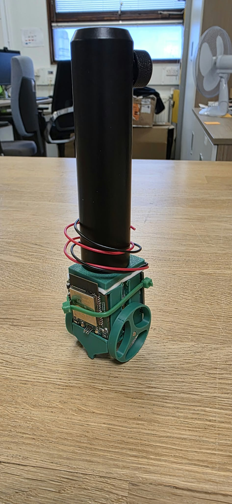
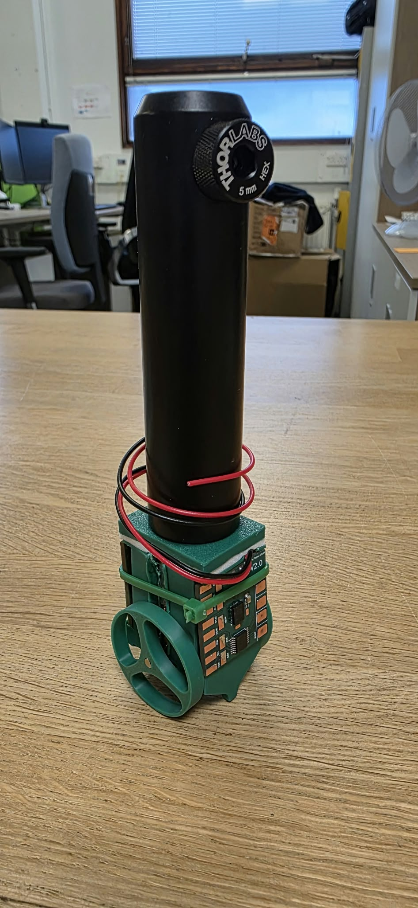
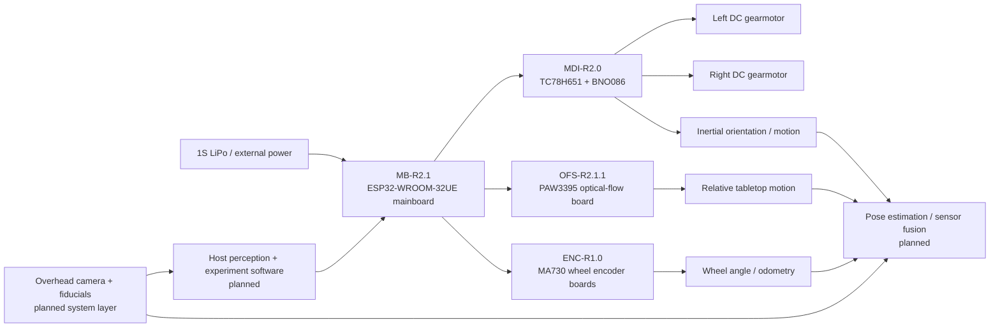
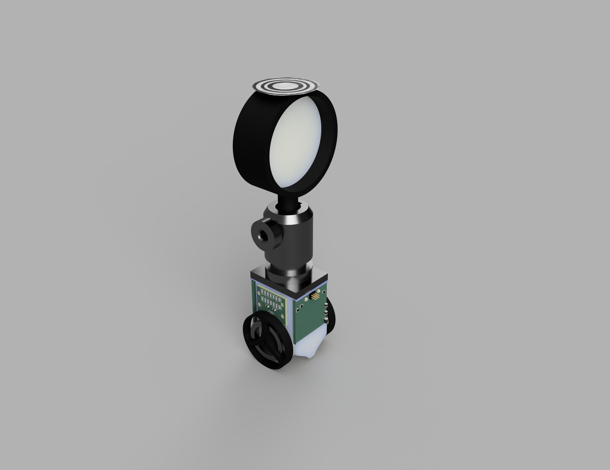
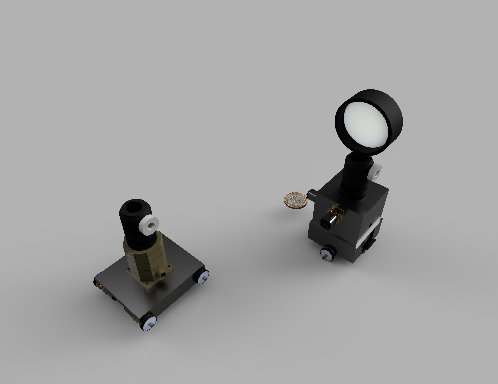
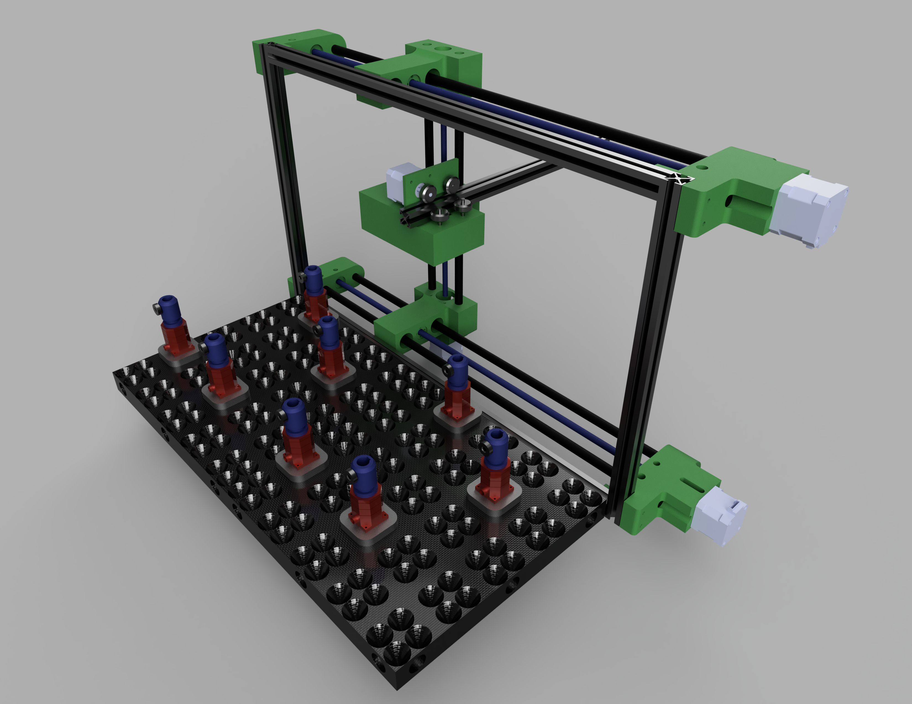

# Autonomous-Photonics-Carrier

**A source-available mobile robotics platform for autonomous and reconfigurable free-space photonics experiments.**

This repository contains the electronics, fabrication files, preliminary embedded firmware, and research documentation for my UCL Electrical and Electronic Engineering third-year BEng project. The carrier is intended to move standard optical hardware around a tabletop, estimate its own motion from complementary sensors, and ultimately support closed-loop optical experiment setup and alignment.

> **Project status — September 2026:** the **Platform V2 hardware design is finished**. Manufacturing and assembly are **partially complete and awaiting remaining parts**. The V2 main controller, motor/IMU board, and MA730 wheel-encoder board have been bench validated. The PAW3395 optical-flow board is the only current board that has not yet been experimentally validated. Full multi-sensor autonomous operation and the experiment-control software are still under development.

<p align="center">
  
  &nbsp;&nbsp;
  
</p>

<p align="center"><em>Current Platform V2 hardware during assembly. Front and rear views of the mobile carrier with the optical-post interface installed. The mechanical and electrical design is complete, while final assembly is still awaiting the remaining parts.</em></p>

## Read this first: platform versions are not board revisions

There are only **two photonics-carrier platform generations** in this repository:

| System generation | Meaning | Status |
|---|---|---|
| **Platform V1** | First integrated/monolithic autonomous-photonics carrier electronics | Historical, validated, superseded by V2 |
| **Platform V2** | Current modular carrier architecture | Current design; system assembly in progress |

The numbers on individual V2 PCBs are **board-local revisions**, not new carrier generations. For example, **OFS-R2.1.1** means *Optical-Flow Sensor board revision 2.1.1*; it is still part of **Platform V2**. The same applies to **MB-R2.1**, **MDI-R2.0**, and **ENC-R1.0**.

See [`VERSIONING.md`](VERSIONING.md) before using fabrication files.

## Why this project exists

Free-space optical experiments are normally assembled and aligned manually. Even a simple setup can require repeated positioning of posts, lenses, polarisers, sources, detectors, and cameras. The long-term research question behind this project is whether a low-cost fleet of mobile optomechanical carriers can make parts of that process **reconfigurable, repeatable, measurable, and eventually autonomous**.

This repository focuses on the carrier layer: motion, embedded electronics, local sensing, and the interfaces needed for higher-level perception and closed-loop experiment control. It does **not** claim that autonomous optical alignment has already been solved; that is the experimental work this platform is intended to enable.

## Research questions

The project is being developed as an experimental research platform rather than only as a mobile-robot hardware build. The central question is:

> **Can a self-propelled optical post-holder module combine mobile positioning, multi-sensor localisation, and optical feedback to autonomously reconstruct and align repeatable free-space photonics experiments?**

The current evaluation is organised around six questions:

1. **Coarse positioning accuracy and repeatability** — How accurately can a carrier reach a commanded planar pose \((x, y, \psi)\), and how closely can it return to that pose over repeated trials? How are the results affected by approach direction, travel distance, wheel slip, payload, and table-surface conditions?
2. **Stationary stability** — How much translational and angular drift occurs while the carrier remains stationary on its wheels? How are the results affected by motor-hold strategy, payload centre of mass, battery voltage, and measurement duration?
3. **Localisation and sensor fusion** — What accuracy and robustness can be achieved using the MA730 wheel encoders, PAW3395 optical-flow sensor, BNO086 IMU, and planned overhead visual fiducials individually and in combination? In particular, can the fused estimate remain useful during wheel slip, short visual occlusion, and accumulated odometry drift?
4. **Closed-loop optical alignment and recovery** — Can optical feedback compensate for the residual mechanical error remaining after mobile positioning? What alignment error, convergence time, capture range, success rate, and recovery behaviour can be achieved?
5. **Experiment reconstruction and operating range** — Can one or more carriers reconstruct the same optical configuration on separate occasions and reproduce the same measurement? For which beam sizes, propagation distances, wavelengths, and classes of tabletop experiment is the achieved positioning performance sufficient?
6. **Compatibility, cost, and scalability** — Can the platform carry standard optical posts and common holders without permanent modification? What payload, centre-of-mass height, battery runtime, and cost per carrier are practical, and how does operation change when multiple carriers share the same workspace?

These questions are intended to map directly onto measurable experiments. Results will only be reported after the relevant mechanical, electronic, localisation, and optical-control subsystems have been implemented and experimentally characterised.

> **Design-evolution note:** the earliest research framing included an on-carrier screw-and-flexure fine-positioning stage and UWB ranging. Those ideas belong to the earlier design direction and are **not core Platform V2 subsystems**. Platform V2 instead focuses on a modular mobile carrier using wheel encoding, bottom optical flow, inertial sensing, planned overhead visual localisation, and later optical feedback. Fine optomechanical correction can be evaluated as a separate layer if required.

## Current Platform V2 architecture



The V2 redesign deliberately separates functions across small PCBs. This makes the system easier to manufacture, debug, replace, and revise than V1's dense integrated board.

### V2 hardware at a glance

| Board ID | Function | Key devices | PCB | Current state |
|---|---|---|---|---|
| **MB-R2.1** | Main controller / power / breakout | ESP32-WROOM-32UE, NCP186 3.3 V LDO | 4-layer, ~25 × 27.1 mm | **Validated** |
| **MDI-R2.0** | Dual motor drive + IMU | TC78H651FGN, BNO086 | 4-layer, ~25 × 27 mm | **Validated** |
| **OFS-R2.1.1** | Bottom optical-flow sensing | PAW3395, AP2127K-1.8 | 2-layer, ~19.3 × 24.0 mm | **Not yet experimentally validated** |
| **ENC-R1.0** | Wheel-angle sensing | MA730 magnetic encoder | 2-layer, ~20 × 16.8 mm | **Validated** |

<p align="center">
  
</p>

<p align="center"><em>Platform V2 design render. The current generation uses a modular electronics architecture so sensing, motor control, and the main controller can be manufactured, debugged, and revised independently.</em></p>

## Design evolution

### Platform V1 — integrated architecture

V1 placed most functions on one approximately **50 × 50 mm, 8-layer PCB**. The design included an **ESP32-S3-WROOM-1**, **DWM3000 UWB**, **BNO086 IMU**, **two TMC5041 stepper-controller ICs**, **DRV8231 motor-driver stages**, and the associated power and USB circuitry. It was a useful integration exercise and was built around the original concept of combining coarse mobile motion with local stepper/flexure positioning.

<p align="center">
  
</p>

<p align="center"><em>Platform V1 concept. The first carrier generation combined the mobile base with local optomechanical positioning and concentrated most of the electronics onto a single integrated PCB.</em></p>

### Why V2 changed direction

The current architecture intentionally moves away from putting every possible function on one carrier PCB. The main reasons were:

- **Modularity:** sensor and motor electronics can be revised without remanufacturing the controller.
- **Debuggability:** faults can be isolated board-by-board.
- **Lower manufacturing risk:** smaller boards and fewer tightly coupled subsystems.
- **Sensor strategy:** PAW3395 relative optical tracking, MA730 wheel angle, BNO086 inertial data, and planned overhead fiducials provide complementary information without retaining UWB as a core requirement.
- **Fine alignment separation:** the mobile base focuses on coarse positioning and repeatability. Very fine optical correction can be implemented as a separate optomechanical layer instead of forcing stepper/flexure hardware into every mobile carrier.
- **Cost and repeatability:** the architecture is intended to scale to multiple carriers, so unnecessary per-carrier complexity matters.

The V1 source is retained because it documents the design path and may still be useful to researchers interested in a more integrated architecture.

### Legacy reference — pre-project mobile robotics hardware

Before the dedicated photonics-carrier generations, I developed a more general mobile-robot electronics platform. It is retained in [`hardware/legacy-reference`](hardware/legacy-reference/) because several practical design lessons carried into this project, but it is **not Platform V0** and should not be treated as part of the carrier version sequence.

<p align="center">
  
</p>

<p align="center"><em>Legacy mobile-robot reference design retained for engineering context. It predates the autonomous-photonics carrier and is included only to document relevant design heritage.</em></p>

## Repository map

```text
Autonomous-Photonics-Carrier/
├── hardware/
│   ├── platform-v1/                 # Historical integrated carrier
│   ├── platform-v2/
│   │   ├── mainboard/MB-R2.1/
│   │   ├── motor-driver-imu/MDI-R2.0/
│   │   ├── optical-flow/OFS-R2.1.1/
│   │   └── wheel-encoder/ENC-R1.0/
│   └── legacy-reference/            # Pre-project robot electronics; not a platform version
├── firmware/preliminary/            # Safe preliminary ESP32 firmware scaffold
├── software/                        # Planned host-side autonomy / experiment software
├── docs/                            # Architecture, methods, validation, manufacturing notes
├── data/                            # Experimental-data conventions; no results claimed yet
├── media/                           # Image/video placeholders
├── VERSIONING.md
├── CHANGELOG.md
├── CITATION.cff
└── LICENSE.md
```

## Hardware source and fabrication files

Native **KiCad source files** are provided alongside fabrication outputs. Current fabrication packages are separated from superseded board revisions so that a Gerber revision cannot be mistaken for a platform generation.

Start here:

- [Platform V1 hardware](hardware/platform-v1/README.md)
- [Platform V2 hardware](hardware/platform-v2/README.md)
- [V2 mainboard — MB-R2.1](hardware/platform-v2/mainboard/MB-R2.1/README.md)
- [Motor/IMU — MDI-R2.0](hardware/platform-v2/motor-driver-imu/MDI-R2.0/README.md)
- [Optical flow — OFS-R2.1.1](hardware/platform-v2/optical-flow/OFS-R2.1.1/README.md)
- [Wheel encoder — ENC-R1.0](hardware/platform-v2/wheel-encoder/ENC-R1.0/README.md)
- [Manufacturing guide](docs/manufacturing.md)

The CSV BOMs in the board folders were auto-extracted from the KiCad PCB files to make review easier. **They are not a substitute for checking the schematic and part datasheets before ordering.**

## Preliminary firmware

A deliberately conservative PlatformIO/Arduino scaffold is included in [`firmware/preliminary`](firmware/preliminary/README.md). It establishes the intended embedded-software structure, status reporting, motor-control abstraction, serial command interface, and placeholders for BNO086, PAW3395, and MA730 integration.

It is **not the final autonomy firmware** and it is **not presented as experimentally validated software**. Peripheral signal-to-GPIO assignment is left disabled by default wherever the uploaded hardware files do not prove the final system interconnect unambiguously. This prevents a public repository from presenting guessed pin mappings as fact.

The preliminary firmware and parts of the repository/software scaffolding were prepared with assistance from **OpenAI ChatGPT 5.6** and then reviewed against the project hardware files. See [`AI_ASSISTANCE.md`](AI_ASSISTANCE.md).

## Planned sensing and autonomy stack

The intended estimation hierarchy is complementary rather than relying on a single sensor:

1. **Wheel angle / odometry:** MA730 magnetic encoders provide direct rotational information at the drivetrain.
2. **Bottom optical flow:** PAW3395 provides high-rate relative motion against the tabletop and can expose wheel-slip/odometry disagreement.
3. **IMU:** BNO086 provides inertial orientation/motion information and short-term dynamic context.
4. **Overhead fiducials:** a camera observing AprilTags or similar fiducials is planned as a global absolute pose reference and recovery mechanism.
5. **Optical feedback:** experimental signals can eventually be incorporated into the control loop so the carrier optimises the *optical result*, not only geometric pose.

Sensor fusion, global localisation, multi-carrier coordination, and optical-feedback optimisation are **planned software work**; they are not claimed as completed results in this repository.

## Research measurements this platform is intended to support

The repository is organised so that later results can be reproduced rather than reported only as a final demo. The principal measurements are:

- planar pose accuracy in **x, y, and yaw** against an external reference;
- **return-to-pose repeatability** over repeated move-away-and-return cycles;
- **stationary drift** and accumulated odometry drift;
- wheel-encoder, optical-flow, and IMU disagreement under controlled motion;
- recovery from deliberate slip or localisation error;
- carrier-to-carrier consistency if multiple units are built;
- cost per carrier and sensitivity to inexpensive mechanical components;
- success rate of a defined optical alignment task.

See [`docs/research-methodology.md`](docs/research-methodology.md) and [`docs/validation.md`](docs/validation.md). Until those experiments are complete, target resolutions or simulated estimates should not be read as measured performance.

For the research context behind the architecture, see [`docs/related-work.md`](docs/related-work.md).

## Research context and selected related work

This project sits between **robotic optical alignment**, **autonomous laboratories**, and **mobile multi-sensor robotics**. The most directly relevant prior work is summarised here; the longer discussion belongs in [`docs/related-work.md`](docs/related-work.md).

- **OptoMate / AI-Driven Robotics for Optics** demonstrates a general-purpose robotic approach to physically assembling and aligning free-space optical experiments using computer vision, robotic manipulation, and AI-assisted control [1]. It is a particularly close research neighbour, but it uses an external robotic manipulator rather than making each optical element independently mobile.
- **Choi et al.** present a closed-loop framework for robotic optical assembly, alignment, and self-recovery [2]. This is directly relevant to the carrier's long-term objective of detecting misalignment, correcting it from measurement feedback, and recovering after a disturbance.
- **Rakhmatulin et al.** review automated laser-optics alignment, including optimisation and machine-learning approaches [3]. Their review motivates treating the optical signal itself as a feedback variable rather than assuming that geometric positioning alone is sufficient.
- **Fang and Savransky** show automated alignment of a reconfigurable optical system using focal-plane sensing and Kalman filtering [4], providing an example of image-based estimation driving corrective optical motion.
- **Szymanski et al.** demonstrate the broader self-driving-laboratory concept in which robotics, measurement, and computational decision-making form a closed experimental loop [5]. The present project explores a different physical layer: making the experimental optical hardware itself reconfigurable on the tabletop.

Commercial active-alignment systems from companies such as Physik Instrumente provide useful industrial context: high-precision automated optical alignment is already practical, but such systems are generally built around dedicated stages and predefined alignment tasks rather than low-cost independently mobile optical carriers [6].

The distinction matters: this repository does **not** claim that the individual techniques above are new. The research question is whether coarse mobile positioning, complementary low-cost sensing, standard optomechanical compatibility, and closed-loop optical feedback can be combined into a scalable carrier architecture for reconfigurable free-space experiments.

## Selected references

1. S. Z. Uddin, S. Vaidya, S. Choudhary, Z. Chen, R. K. Salib, L. Huang, D. R. Englund, and M. Soljačić, **“AI-Driven Robotics for Optics,”** arXiv:2505.17985, 2025. https://doi.org/10.48550/arXiv.2505.17985
2. S. Choi, S. Vaidya, C. Silva, S. Z. Uddin, S. B. Shuvo, S. Choudhary, and M. Soljačić, **“A Framework for Closed-Loop Robotic Assembly, Alignment and Self-Recovery of Precision Optical Systems,”** arXiv:2603.21496, 2026. https://doi.org/10.48550/arXiv.2603.21496
3. I. Rakhmatulin, D. Risbridger, R. Carter, M. J. D. Esser, and M. S. Erden, **“A Review of Automation of Laser Optics Alignment with a Focus on Machine Learning Applications,”** *Optics and Lasers in Engineering*, vol. 173, 107923, 2024. https://doi.org/10.1016/j.optlaseng.2023.107923
4. J. Fang and D. Savransky, **“Automated Alignment of a Reconfigurable Optical System Using Focal-Plane Sensing and Kalman Filtering,”** arXiv:1608.07550, 2016. https://arxiv.org/abs/1608.07550
5. N. J. Szymanski *et al.*, **“An Autonomous Laboratory for the Accelerated Synthesis of Inorganic Materials,”** *Nature*, vol. 624, pp. 86–91, 2023. https://doi.org/10.1038/s41586-023-06734-w
6. PI (Physik Instrumente), **“Active Photonics Alignment Systems / Fiber Optic Alignment Stages,”** product and application documentation. https://www.pi-usa.us/en/products/photonics-alignment-solutions

## Project information

**Author:** Taylan Arslan  
**Programme:** UCL Electrical and Electronic Engineering — BEng third-year project, 2026–27  
**Project supervisor:** Prof. Kaan Akşit  
**EEE co-supervisor:** Thomas Gilbert

The supervisors are acknowledged for academic supervision; this repository is maintained by the author and is **not an official UCL product or endorsement**.

## Contributing

Research feedback, reproducibility reports, bug findings, and non-commercial improvements are welcome. Please read [`CONTRIBUTING.md`](CONTRIBUTING.md) before opening a pull request. In particular, use the versioning vocabulary above when discussing hardware revisions.

## Licensing

This repository is intentionally **source-available for non-commercial research, education, and personal experimentation**, but it does **not** grant commercial-use rights under its public licences.

- Hardware design files, documentation, diagrams, and repository media: **CC BY-NC 4.0**.
- Firmware and software: **PolyForm Noncommercial License 1.0.0**.
- Commercial use requires a **separate written commercial licence** from the author.

Because of the non-commercial restriction, this project should **not** be described as OSHWA-compliant “open-source hardware.” See [`LICENSE.md`](LICENSE.md) for the exact scope and important IP limitations.

## Safety and experimental responsibility

This is research hardware, not a certified product. Re-check power rails, polarity, motor current, battery protection/charging, connector orientation, clearances, and fabrication outputs before use. If the carrier is used around lasers or other optical sources, follow the laboratory's laser-safety procedures; this repository does not replace a risk assessment or device datasheet.
